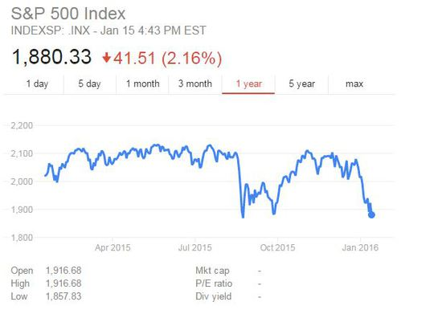

HTML5-figure,figcaption标记
==========================

## 知识点

* figure
* figcaption

### figure

figure标记用来表示图片，图表，插图，代码等内容。

### figcaption

figcaption标记是为图片增加标题或者说明，是figure标记的子标记。

## 综合例

显示图片并且添加说明文。

~~~html
<article>
    <header>
        <h1>美股大跌之后 基本面投资者蠢蠢欲动</h1>
    </header>
    
资本市场的波动是一群观点迥异投资者之间的博弈的体现，最近两周美股出现四年多来最大跌幅，对于不少投资者来说，心中充满恐慌情绪，但对于另外一部分投资者，他们兴奋的看到“抄底”的好机会越来越近了。

    <figure>
        
        <figcaption>美国标普500指数最近两周放量重搓8.13%，录得2011年11月来最大两周跌幅</figcaption>
    </figure>
</article>
~~~

## 源代码

https://github.com/komavideo/LearnHTML5

## 小马视频频道

http://komavideo.com
